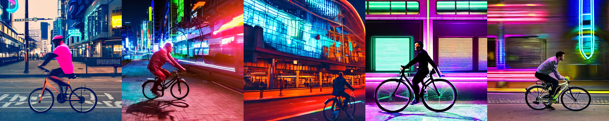

# Stable Diffusion Tutorial


## Installation:
It is recommended to run the `env.yml` file for ensuring no conflicts.
* Setting up the conda env:
```sh
conda create -f env.yml
```
* In case you're not able to find the directory containing **generated images**, you can download it by running the following command in the terminal under the **same directory**:
```sh
$ chmod +x utils/download_images.sh
$ sh utils/download_images.sh
```           
The directory structure will look something like this:

```sh
├── README.md
├── env.yml
├── generated_images
│   ├── image_1.png
│   ├── image_2.png
│   ├── image_3.png
│   ├── image_4.png
│   └── image_5.png
├── images
│   ├── all_generated_images.png
│   ├── grayscale_comparison.png
│   ├── histogram_comparison.png
│   ├── loading_tensors.png
│   ├── resized_compariso.png
│   └── stable_diff_img.png
├── processed_image_array.npy
├── src
│   └── flux_model
│       └── flux_model.ipynb
└── utils
    ├── download_images.sh
    ├── preprocess.py
    └── verify_tensors.py
```

## Implementation details
**1. Image Generation:**  This [colab notebook](https://colab.research.google.com/drive/1unuR9Ta4i7qlV-Ll9RfBjkyN9dEA0Xwf?usp=sharing) contains all the steps for using **Diffusers** for generating synthetic images. This notebook generates 5 images with the prompt: <span style="color:orange">*"a man riding bike in a futuristic city with a neon lights in the background"*</span>. A a detailed technical explanation, please refer [here](https://github.com/kulendu/stable-diffusion-pipeline/blob/master/src/flux_model/STABLE_DIFF.md).


**2. Preprocessing the generated images:**
Following processings are done:

1. `Resizing the image`: The `512 x 512` image is resized to `256 x 256`. Following image shows the comparision between original image (left) and resized image (right).


2. `Converting to grayscale`: This conversion is done for simplifying the input to the CNN.


3. `Normalizing the pixel values`: Normalizing the pixel values (0-255) to a standard scale of 0-1. 


the image shows the histograms of original and the normalized image (note the scales).

4. Converting the processed images in tensor format, [.npy file](./processed_image_array.npy)

`NOTE:` This [script](./utils/verify_tensors.py) verifys the shape of the dumped numpy file, and can be modifies further according to the use case.


**3. Building the CNN:** Implementation details for building the architecture can be found [here](./src/flux_model/flux_model.ipynb)