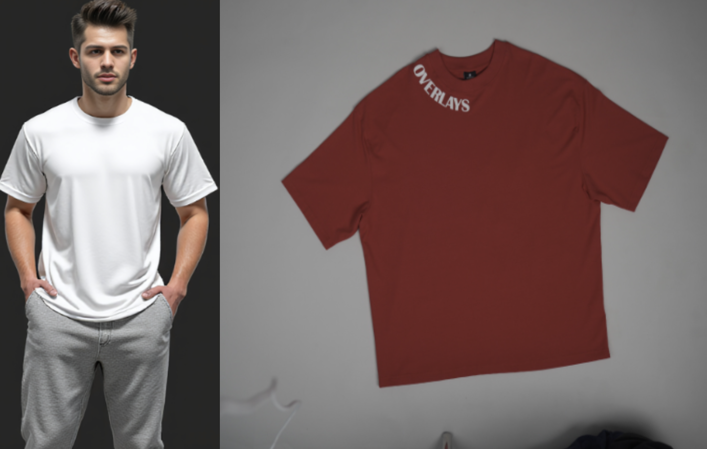
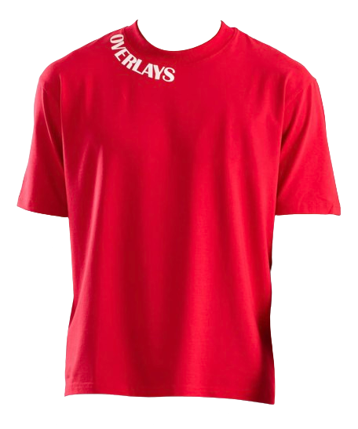
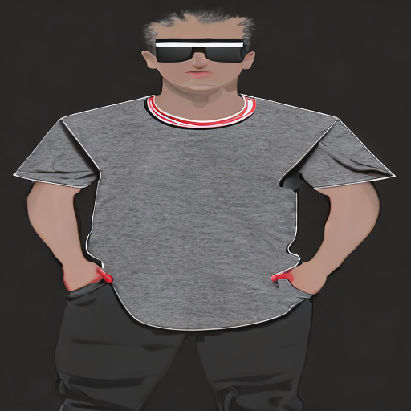
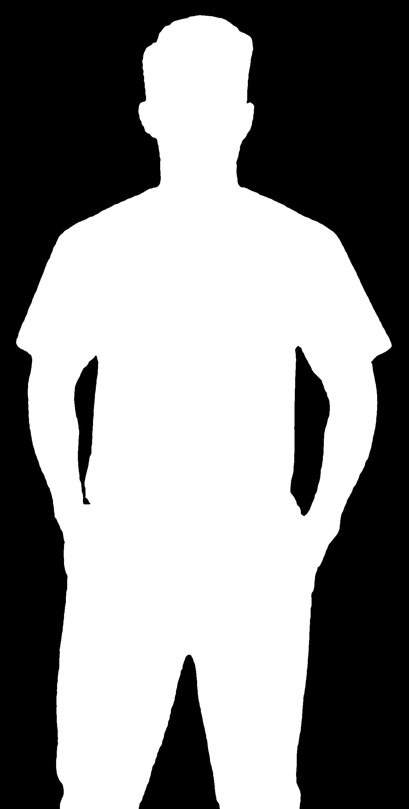
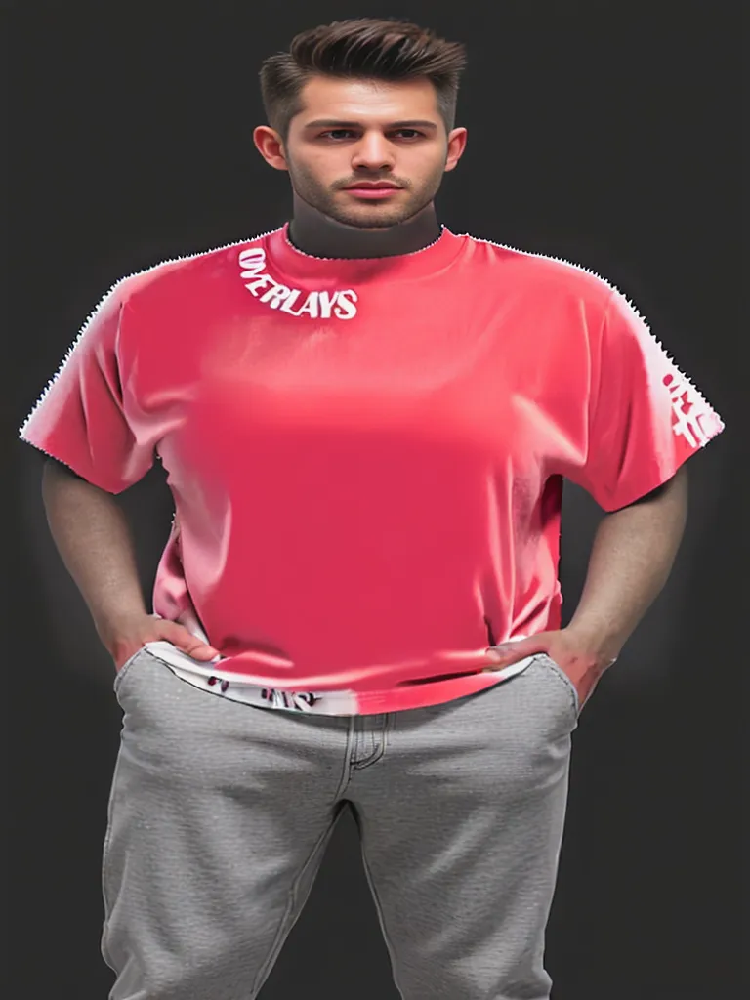
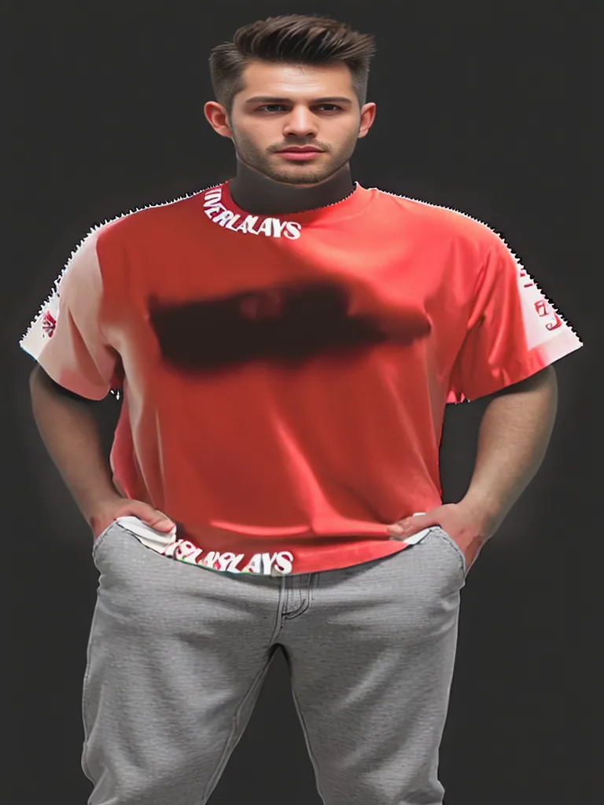
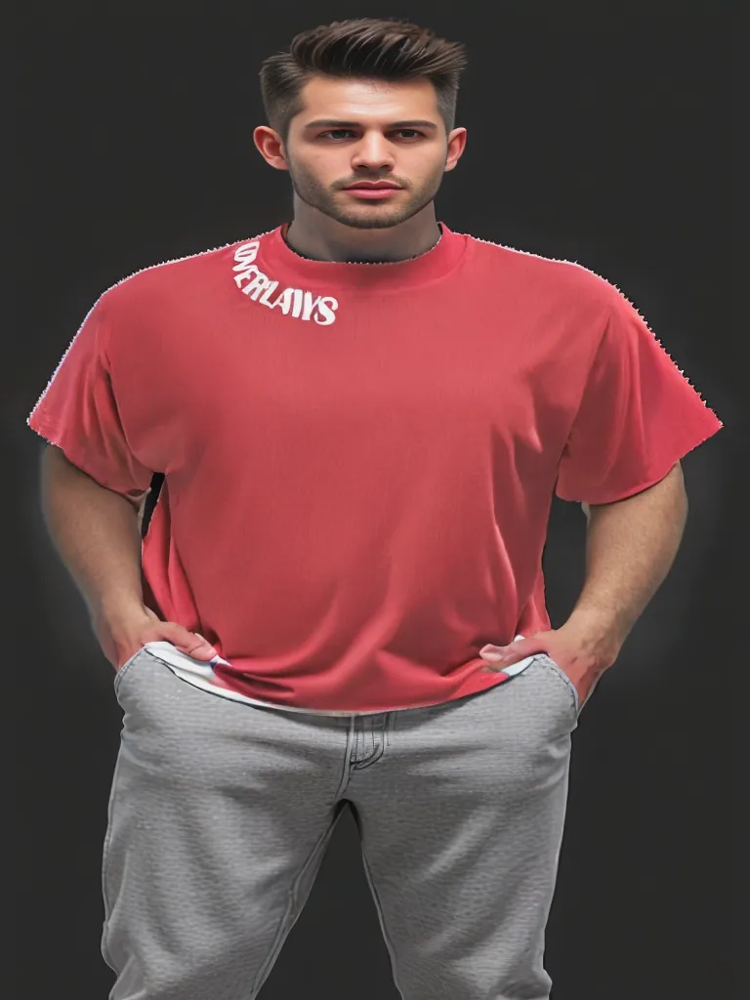

## Image Diffusion
`Task:` Take two images, and using Diffusion Models to merge them while keeping the semantics same to generate a single image. Image (*left*) of a person whose T-shirt needed to be changed, and image (*right*) of the T-shirt to which it should change.

### Data Tweaking
Using image of the t-shirt (*right*), as the guided image, the model fail to produce accurate drape on the model's image. So to overcome this, same image of the Tshirt from [overlays](https://overlaysnow.com/products/be-the-change-navy-blue-relaxed-fit-t-shirt-ultra-soft-copy) have been taken and the further segmented from the body to create a more detailed and zoomed guidance for the model to preseve the high frequence details. 

</img>

### Experiments
1. **Flux Dev/Schell**: Family of Flux models such as: [Flux.1 [schell]](https://huggingface.co/black-forest-labs/FLUX.1-schnell) and [FLUX.1 [dev]](https://huggingface.co/black-forest-labs/FLUX.1-dev) are great, and also can produce high quality images, but the bottleneck comes in computation. So [Flux.1 [schell]](https://huggingface.co/black-forest-labs/FLUX.1-schnell) is definately faster compared to [FLUX.1 [dev]](https://huggingface.co/black-forest-labs/FLUX.1-dev), but schell can run on macOS (Metal chips), but again the runtime is very slow, and also crashes sometimes, depending on the quality of prompt given.

2. **Stable Diffusion/ControlNet**: Using [ControlNet]() for pose preservation, [Stable Diffusion]() for inpainting pipeline, [Segformer](https://arxiv.org/pdf/2105.15203) for creating a mask for the T-shirt area using segmentation, and prompting the diffusion model generated the following result 👇 

</img>
</img>

The script can be accessed here: [main.py](https://github.com/kulendu/stable-diffusion-pipeline/blob/master/src/fashion_diffusion/main.py) 

3. **OOTDiffusion**: [OOTDiffusion](https://arxiv.org/abs/2403.01779) shows the best result. Since the architecture used here includes training for both full-body and half-body generating realisitic impainting as well as generalization.
The model checkpoints trained on [VITON-HD](https://github.com/shadow2496/VITON-HD) and [Dress Code](https://github.com/aimagelab/dress-code) for full body and half body respectively. The novelty lies in their training strategy as well as embeddings in the latent spaces, as well as for masking the garments perfectly for perfect try-on results.

| Generated Try-ons      | Parameter tunings      |
| ------------- | ------------- |
| </img> | steps = 27   guidance_steps = 5   seed = -1|
| </img> | steps = 27   guidance_steps = 5   seed = -1|
| </img> | steps = 21   guidance_steps = 2.5   seed = -1|

